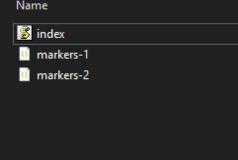

# Castia Marker Comp Tool

This is an UNFINISHED commandline utility that I just coded for myself. You need some technical understanding to use this thing.

## Prerequisites

You'll need:

- [node.js 21](https://nodejs.org/en/download/prebuilt-installer/current)
- [this script](https://raw.githubusercontent.com/Crafter-Y/markerComp/refs/heads/main/index.js)

you can check if your node.js installation works by typing `node --version` in your command promt. It should show you something like `v.21.x.x`.

## How to use this thing

1. You need to capture the livemap state before and after the towns fall.

   Just download this file:

   https://map.castiamc.com/tiles/minecraft_overworld/markers.json

   (open the link and save the `.json` file with ctrl+s)

2. Put the file from before beside the index.js and name it `markers-1.json`

3. Put the file from after the towns fell also beside the index.js and name it `markers-2.json`

4. Open a command prompt in the directory of the index.js

5. Execute `node .` to run the script

## Read the output

The output contains 3 parts:

- A list of all the chunks that are no longer saved with their town name
- A "readable" json array of the fallen towns
- A list of minimap entries for [Xaero's Minimap](https://modrinth.com/mod/xaeros-minimap)
